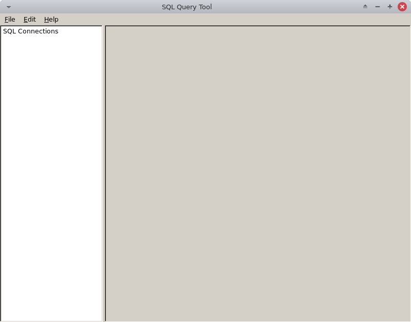

# querytool
A simple GUI based SQL query tool

# Dependencies

* FOX Toolkit [repology](https://repology.org/project/fox-toolkit/versions)
* cJSON [repology](https://repology.org/project/cjson/versions)

On Debian based distros you can install the dependencies with apt-get:

```
sudo apt-get install libfox-1.6-dev libcjson-dev
```

# Building

Use CMake

```
mkdir build
cd build
cmake ..
make
```

# Screenshots


